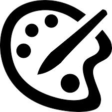

## reflection 

The website provides 3 main features:

1. **Pencil** - this tool lets users adjust the size of their brush. 

2. **The Color Pallet** - a color picker that allows users to change the color of the brush. 

3. **Eraser** - a brush that permanently paints with white, effectively removing other colors.

## Contact

You can drop me a DM on discord: `khenzii`. 

