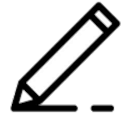

## The Overall view
The website has 3 main functionalities (besides the big github logo that redirects you to this repo).

The first one is the pencil, it allows users to make the coloured square that appears after clicking the canvas *bigger/smaller*.
 

The second one is the colour pallete, it allows users to make the coloured square that appears after clicking the canvas to have *different colour*.
 

The third one is the eraser, it allows users to *remove* the coloured squares that appears after clicking the canvas.
 

## Important Notes
The website is hosted on <a href="https://www.pythonanywhere.com">pythonanywhere</a> because the <a href="https://www.freenom.com">Freenom</a> and <a href="http://www.dot.tk">DotTK</a> seems to not work?? I would usally grab free domains from freenom for small projects like this one, but they seem dead. A couple of weeks ago whenever trying to register an new domain they showed that every domain is taken and there was a little note saying that they are running into technical issues, but now even the register buttons on theirs pages seems to not work.

Also please note that i am not an web dev, in fact i rarely use html, css & js, if you think that the code is written badly, please share your thoughts and tips. Thanks!

## Contact

you can find the developer of this project (aka "Khenzii" :>) here: discord - **khenzii**
