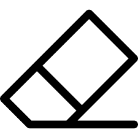

## reflection 

The website has 3 main functionalities (besides the big github logo that redirects you to this repo).

The first one is the pencil, it allows users to make the coloured square that appears after clicking the canvas *bigger/smaller*.
 

The second one is the colour pallete, it allows users to *change* the color of squares that appear after using the canvas.
 

The third one is the eraser, it allows users to *remove* the coloured squares that appears after clicking the canvas.
 

## Contact

You can drop me a DM on discord: `khenzii`. 

